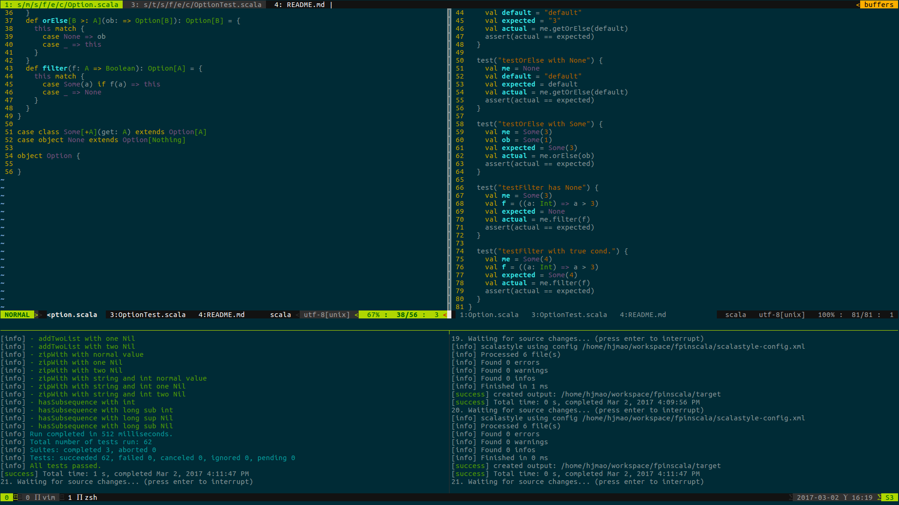

# Exercise Answers for FPinScala

This project holds all my exercise answers to the book [**Functional Programming in Scala**](https://www.manning.com/books/functional-programming-in-scala).

~~You may find the ebook [here](https://pdf.k0nsl.org/C/Computer%20and%20Internet%20Collection/2015%20Computer%20and%20Internet%20Collection%20part%202/Manning%20Functional%20Programming%20in%20Scala%20(2015).pdf).~~

## Project Layout

```
.
├── build.sbt
├── doc
│   └── fpinscala.pdf
├── LICENSE
├── project
│   └── plugins.sbt
├── README.md
├── scalastyle-config.xml
└── src
    ├── main
    │   ├── java
    │   ├── resources
    │   └── scala
    │       └── fpinscala
    │           ├── examples
    │           │   └── ch02gettingstarted
    │           │       └── GettingStarted.scala
    │           └── exercises
    │               └── ch02gettingstarted
    │                   └── GettingStarted.scala
    └── test
        ├── java
        ├── resources
        └── scala
            └── fpinscala
                └── exercises
                    └── ch03datastructures
                        └── ListSuite.scala

19 directories, 8 files
```

All the exercise answers are included in `src/main/scala/fpinscala/`,
while the test code are put in `src/test/scala/fpinscala/`.

[ScalaTest](http://www.scalatest.org/) is used in the test cases.
So after finish the exercises code,
you may add the test cases in the test directory to check if your answer is right.

When you are working on the exercises, the steps might be the followings:

``` shell
sbt ~scalastyle # To check if the code style are all correct
sbt ~test # To check if all the test cases passes
```

Here is a snapshot of my workspace in Vim with tmux enabled.
Exercise answer code in upper left part, and test code in upper right,
while the lower left is an area for running `sbt ~test` and `sbt ~scalastyle` in the lower right.




## With IntelliJ IDEA

[IntelliJ IDEA](https://www.jetbrains.com/idea/) is powerful IDE for many programming languages.
You would probably like to use it as your main IDE.

This project can be opened in IDEA directly.


## Code Style

This project uses [scalastyle](http://www.scalastyle.org/sbt.html) by adding the plugin config in [`project/plugins.sbt`](https://github.com/huajianmao/fpinscala/blob/master/project/plugins.sbt). The style config file used in this project is from [Spark](https://github.com/apache/spark/blob/master/scalastyle-config.xml). If you do not like the spark code style, you may generate a new style config file yourself by `sbt scalastyleGenerateConfig`. And after that, you can check the code style by running `sbt scalastyle`.
